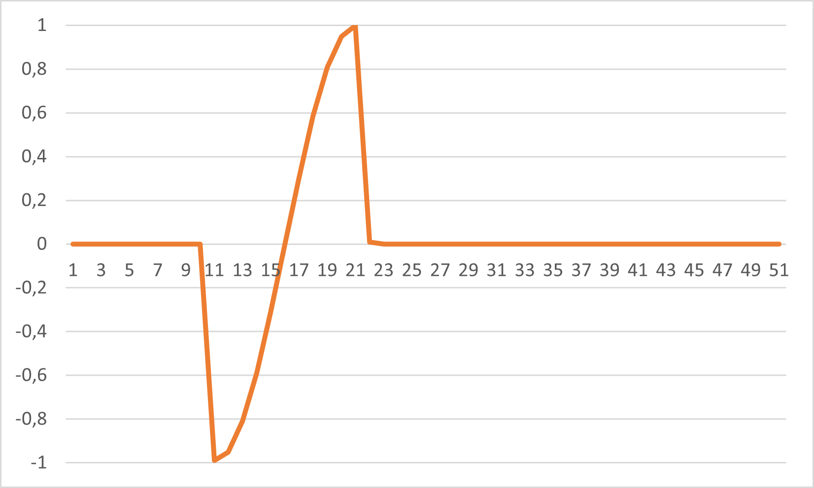
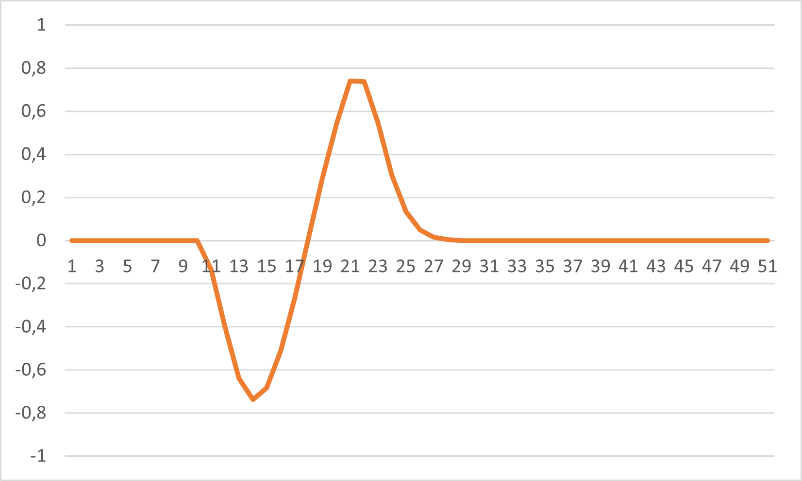
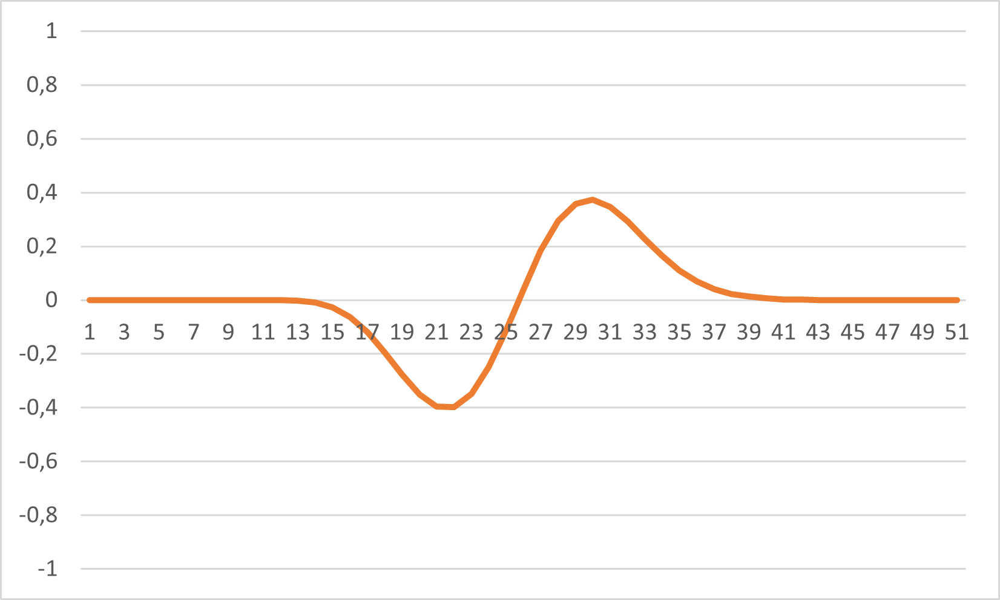
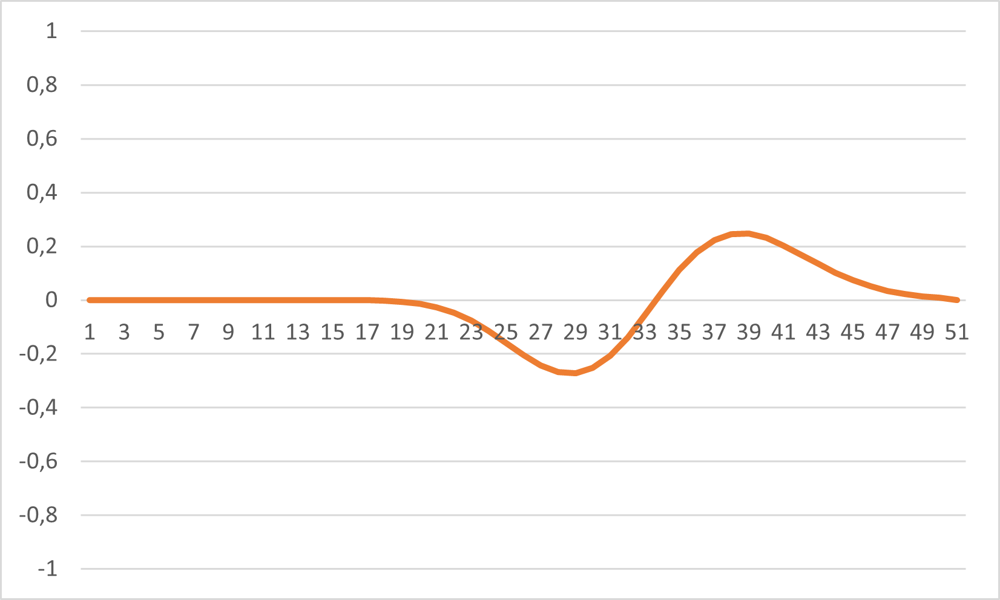

# Wave Propagation Simulation

This project simulates the propagation of a wave using a numerical method. The simulation uses a simple finite-difference scheme to update the wave field over time. The code is written in C++ and outputs the results to a text file, which are visualized in four images to show the evolution of the wave.

## Code Overview

The code implements a 1D wave equation solver. It initializes a wave field with a cosine function over a specified range and iteratively updates the field to simulate wave propagation. The key parameters include:

- `dx`: Spatial step size
- `dt`: Time step size
- `u`: Wave speed

The code runs for 600 iterations, and the state of the wave field is recorded every 450 iterations.

## Results

The simulation results are visualized in the following images, which show the dynamics of wave propagation over time:

| Step 1 | Step 2 |
|--------|--------|
|  |  |

| Step 3 | Step 4 |
|--------|--------|
|  |  |

These images demonstrate how the wave field evolves and propagates at different stages of the simulation.

## Code Structure

- **Initialization**: Sets up the wave field and parameters.
- **Main Loop**: Updates the wave field using the finite-difference method.
- **Output**: Records the wave field to a text file at specified intervals.

## Dependencies

- C++ compiler (e.g., g++)

## Usage

1. Compile the code using a C++ compiler.
2. Run the executable to generate the wave propagation data.
3. View the results in `file.txt` and the corresponding images to analyze the w
